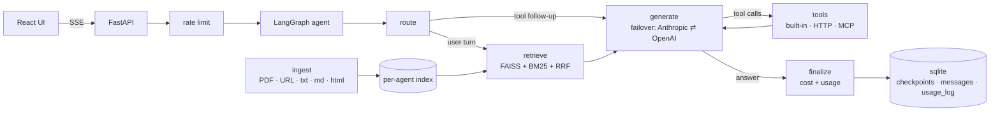

# AgentForge

**Build AI agents from your documents in minutes.** Upload PDFs, paste URLs, or drop in text. AgentForge creates an agent that answers from your content with source citations and takes actions through HTTP and MCP tools.

[](https://github.com/ishay60/agentforge/actions/workflows/ci.yml)
[](backend/pyproject.toml)
[](LICENSE)

Built in Python with FastAPI and LangGraph, with a React frontend. Deep dive: [ARCHITECTURE.md](ARCHITECTURE.md). Original build spec: [`docs/ai_agent_platform_spec.md`](docs/ai_agent_platform_spec.md).

## Features

- **Hybrid search**: FAISS dense + BM25 sparse, merged with Reciprocal Rank Fusion, one index per agent.
- **LangGraph agent**: `route → retrieve → generate ⇄ tools → finalize`, conversation memory in a sqlite checkpointer, tool errors fed back to the model, 8-round tool cap.
- **Tools**: built-ins (`calculate`, `get_current_time`, `search_knowledge_base`), HTTP webhooks, and any MCP server over stdio or streamable HTTP. Tool output is wrapped as untrusted data (pattern from [mcpolyglot](https://github.com/ishay60/mcpolyglot)).
- **Multi-provider LLMs**: Anthropic and OpenAI with a circuit-breaker failover and per-model cost tracking.
- **Streaming chat**: SSE with `retrieval`, `token`, `tool_call`, `tool_result`, and `done` events.
- **Analytics**: per-agent conversations, messages, cost, latency, daily series, and per-model breakdown.
- **Eval suite**: 19 cases covering RAG accuracy, tool selection, refusal, and multi-step; runs without an API key, or live with one.
- **React frontend**: agents, chat with citations and tool cards, document upload, tool config, analytics.
- **Ops**: Docker Compose, GitHub Actions CI, rate limiting, JSON logs.

## Architecture



Retrieved context is injected per turn and never persisted into the thread. Tool errors come back to the model as messages, so a failing endpoint is something it can recover from rather than a crash. See [ARCHITECTURE.md](ARCHITECTURE.md) for every hop of a request.

## Quick start

```bash
git clone https://github.com/ishay60/agentforge.git && cd agentforge
cp .env.example .env            # add ANTHROPIC_API_KEY and/or OPENAI_API_KEY
docker compose up --build       # frontend http://localhost:3000, API docs http://localhost:8000/docs
```

Local development:

```bash
make dev-backend                # uvicorn on :8000 with reload
make dev-frontend               # vite on :5173, proxies /api to :8000
make test                       # backend tests + eval suite, no API key needed
```

CLI without the server:

```bash
cd backend
uv run python -m agentforge.cli ingest demo https://example.com ./some.pdf
uv run python -m agentforge.cli query demo "how do I reset my password"
uv run python -m agentforge.cli chat demo
```

## API (`/api/v1`)

| Method | Path | Notes |
|---|---|---|
| POST | `/agents` | name, system_prompt, llm_provider, llm_model, temperature, top_k, hybrid_alpha |
| GET | `/agents` | counts and total cost per agent |
| POST | `/agents/{id}/documents` | multipart `file` or JSON `{"url": …}`; 409 on duplicate content |
| GET | `/agents/{id}/documents` | |
| POST | `/agents/{id}/tools` | HTTP tool: name, description, http_url, http_method, parameters_schema |
| POST | `/agents/{id}/tools/mcp` | `{"target": "http://host/mcp"}` or `{"target": "node server.js serve"}` |
| GET | `/agents/{id}/tools` | |
| POST | `/agents/{id}/chat` | SSE stream; pass `conversation_id` to continue a thread |
| GET | `/agents/{id}/conversations` | |
| GET | `/agents/{id}/conversations/{cid}/messages` | full thread including tool messages |
| GET | `/agents/{id}/analytics?period=7d` | summary, daily, model_breakdown |

```bash
curl -N localhost:8000/api/v1/agents/$ID/chat -H 'content-type: application/json' \
  -d '{"message":"what does the return policy say? also what is 17*23"}'
```

## How the agent decides RAG vs tools

Every fresh user turn runs hybrid retrieval first (when the agent has an index) and injects the top chunks as context. The model also gets `search_knowledge_base` as a tool for follow-up lookups mid-reasoning, plus the built-ins and any registered HTTP or MCP tools. Tool exceptions become tool messages, so the model sees the error and recovers instead of the turn failing. If every LLM provider is down, the turn returns an apology message rather than a 500.

## Evaluation

```bash
cd backend
uv run pytest tests/eval -q                                   # scripted LLM, checks the harness end to end
AGENTFORGE_EVAL_LIVE=1 uv run pytest tests/eval -q            # real model, needs an API key
```

See [`backend/tests/eval/README.md`](backend/tests/eval/README.md).

## Layout

```
backend/agentforge/
  ingestion.py   sources -> chunks
  retriever.py   HybridRetriever (FAISS + BM25 + RRF), save/load per agent
  llm.py         get_llm, invoke_with_failover, calculate_cost
  tools.py       built-ins, make_http_tool, discover_mcp / make_mcp_tool, build_tools
  agent.py       LangGraph graph, chat() SSE event generator, history()
  db.py          sqlite persistence + analytics queries
  api.py         FastAPI app, rate limiter, JSON logging
  cli.py         ingest / query / chat
backend/tests/   unit + integration tests, tests/eval/ quality suite
frontend/src/    Agents, Agent (documents, tools, analytics, conversations), Chat, api.ts (SSE parser)
```

## Design decisions

- **Hybrid search over pure vectors.** Dense embeddings miss exact tokens like error codes and SKUs; BM25 misses paraphrase. Reciprocal Rank Fusion merges both without score calibration.
- **LangGraph over a linear chain.** The tool loop is a cycle with a cap, retrieval is conditional, and memory is a checkpointer keyed by conversation. A state machine makes those explicit and inspectable.
- **MCP alongside HTTP tools.** Any MCP server becomes agent tools with zero glue code, including stdio servers. Results are wrapped as untrusted data to blunt prompt injection through fetched content.
- **Failover in 60 lines, not a library.** A circuit breaker per provider and a fallback chain. An outage is a log line.
- **Eval suite that runs without a key.** A scripted fake model drives the real graph, so retrieval, tool dispatch, and streaming are checked in CI on every push.
- **Monolith, sqlite, no queue.** Each simplification is marked `ponytail:` in code with its ceiling and the upgrade path. The table is in [ARCHITECTURE.md](ARCHITECTURE.md#deliberate-simplifications).

## Tests

| Suite | What it covers | Count |
|---|---|---|
| `tests/test_pipeline.py` | ingestion of txt, html, pdf; hybrid search; persistence | 1 end-to-end |
| `tests/test_tools.py` | MCP discovery and calls over stdio, HTTP tool, registry | 3 |
| `tests/test_agent.py` | full agent loop through the API with a scripted LLM: retrieval, parallel tool calls, tool error recovery, memory, provider outage, persistence, analytics, rate limiting | 3 |
| `tests/eval/` | RAG accuracy, tool selection, refusal, multi-step | 19 |

All run in CI with no API key.

## License

MIT
